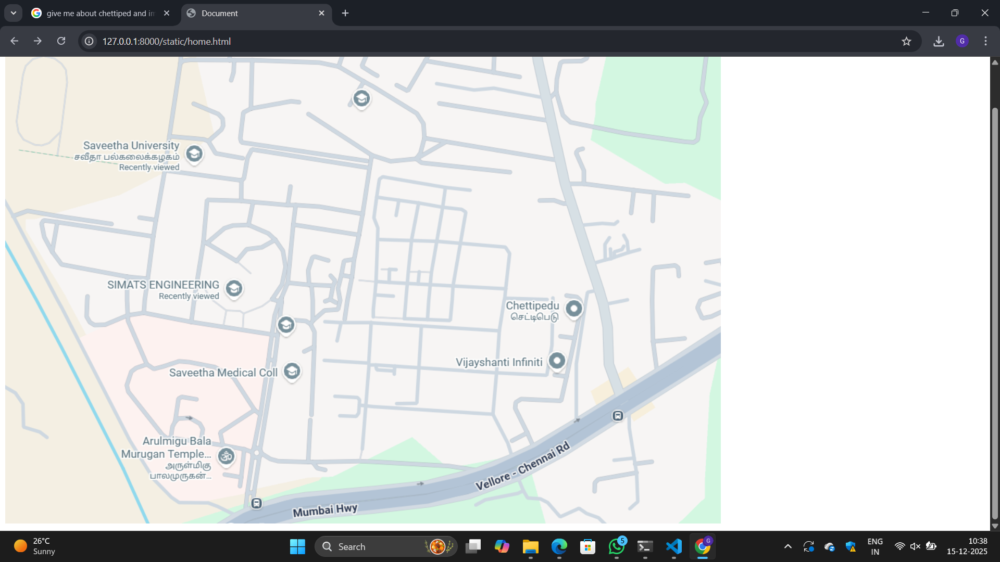
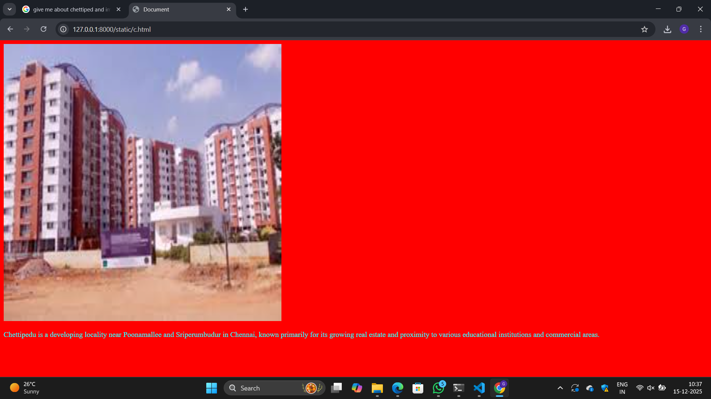
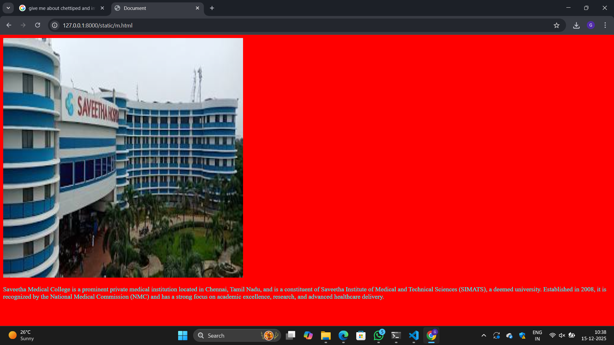
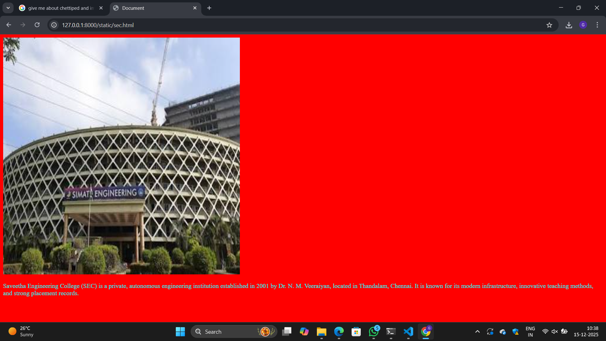

# Ex04 Places Around Me
## Date: 15/12/2025

## AIM
To develop a website to display details about the places around my house.

## DESIGN STEPS

### STEP 1
Create a Django admin interface.

### STEP 2
Download your city map from Google.

### STEP 3
Using ```<map>``` tag name the map.

### STEP 4
Create clickable regions in the image using ```<area>``` tag.

### STEP 5
Write HTML programs for all the regions identified.

### STEP 6
Execute the programs and publish them.

## CODE
```
home.html
<!DOCTYPE html>
<html lang="en">
<head>
    <meta charset="UTF-8">
    <meta name="viewport" content="width=device-width, initial-scale=1.0">
    <title>Document</title>
</head>
<body>
    <!-- Image Map Generated by http://www.image-map.net/ -->


<map name="image-map">
    <area target="" alt="SEC" title="SEC" href="sec.html" coords="189,381,411,454" shape="rect">
    <area target="" alt="Medical" title="Medical" href="m.html" coords="416,580,51" shape="circle">
    <area target="" alt="Chettiped" title="Chettiped" href="c.html" coords="830,446,898,403,975,435,961,501,910,550,845,528" shape="poly">
</map>
</body>
</html>
c.html
<!DOCTYPE html>
<html lang="en">
<head>
    <meta charset="UTF-8">
    <meta name="viewport" content="width=device-width, initial-scale=1.0">
    <title>Document</title>
</head>
<body bgcolor="red" text="cyan">
    
    <p>Chettipedu is a developing locality near Poonamallee and Sriperumbudur in Chennai, known primarily for its growing real estate and proximity to various educational institutions and commercial areas.</p>
</body>
</html>
m.html
<!DOCTYPE html>
<html lang="en">
<head>
    <meta charset="UTF-8">
    <meta name="viewport" content="width=device-width, initial-scale=1.0">
    <title>Document</title>
</head>
<body bgcolor="red" text="cyan">
    
    <p>Saveetha Medical College is a prominent private medical institution located in Chennai, Tamil Nadu, and is a constituent of Saveetha Institute of Medical and Technical Sciences (SIMATS), a deemed university. Established in 2008, it is recognized by the National Medical Commission (NMC) and has a strong focus on academic excellence, research, and advanced healthcare delivery.</p> 
    
</body>
</html>
sec.html
<!DOCTYPE html>
<html lang="en">
<head>
    <meta charset="UTF-8">
    <meta name="viewport" content="width=device-width, initial-scale=1.0">
    <title>Document</title>
</head>
<body bgcolor="red" text="cyan">
    
    <p>Saveetha Engineering College (SEC) is a private, autonomous engineering institution established in 2001 by Dr. N. M. Veeraiyan, located in Thandalam, Chennai. It is known for its modern infrastructure, innovative teaching methods, and strong placement records. </p>
    
</body>
</html>
```

## OUTPUT










## RESULT
The program for implementing image maps using HTML is executed successfully.
